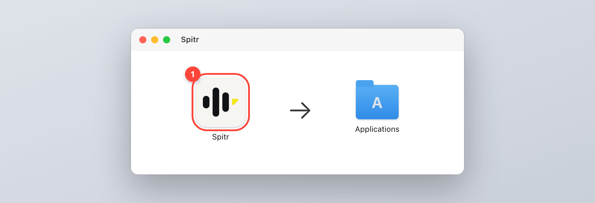
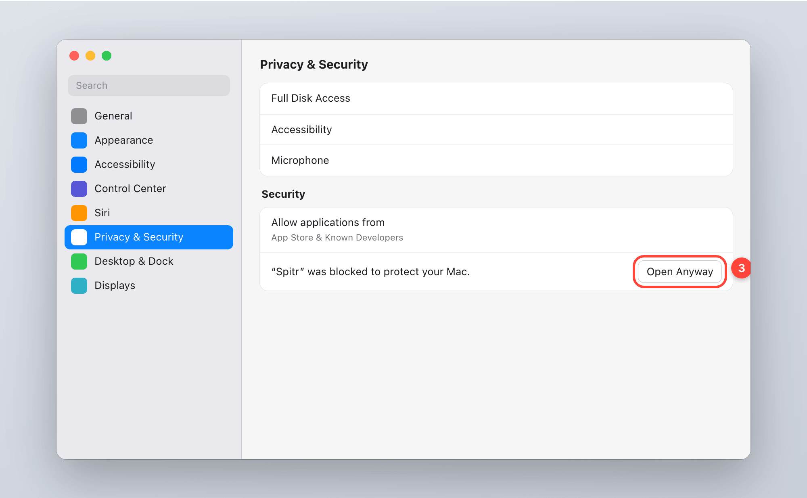
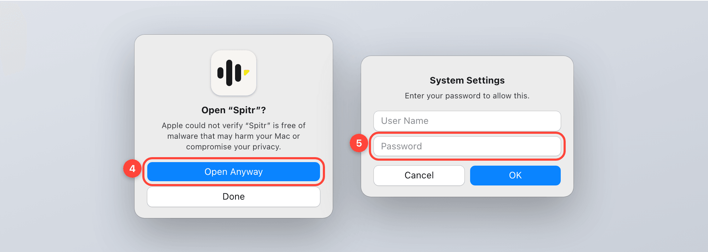
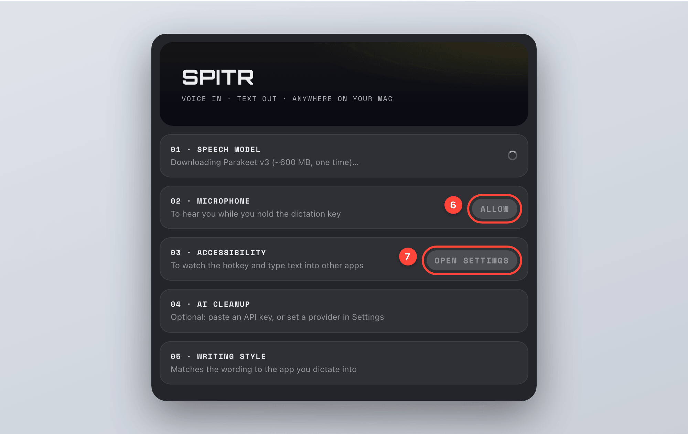
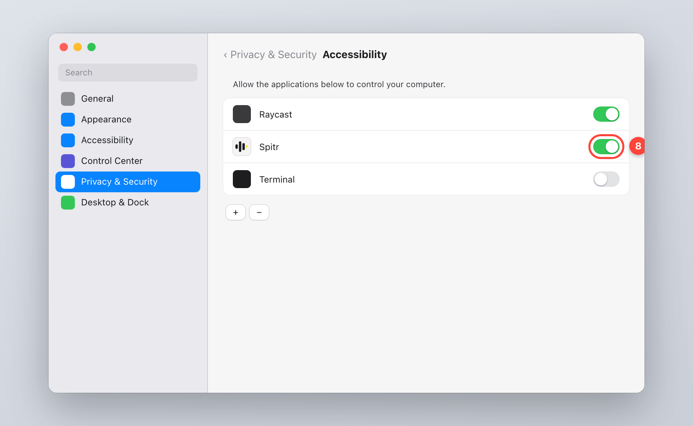

# Install spitr on macOS

Requires macOS 14 Sonoma or later on a Mac with Apple silicon (M1 or newer); Intel Macs are not supported. Setup takes about five minutes,
most of it the one-time download of the speech model.

> The pictures below are illustrations of each step, not screenshots. The buttons and settings you
> click have the names macOS shows; the wording of the messages around them can differ slightly
> between macOS versions.

## 1. Download and copy to Applications

1. Open the [latest release](https://github.com/MotionComplex/spitr-releases/releases/latest) and
   download `spitr-<version>.dmg`.
2. Open the DMG and drag **Spitr** onto **Applications**.
3. Eject the DMG.

## 2. Allow the first launch

spitr is signed, but not with an Apple Developer ID and not notarized by Apple, so macOS blocks the
first launch. You allow it once; after that it opens like any other app.

1. Open **Spitr** from Applications. macOS says it could not verify the app. Click **Done**
   (not *Move to Trash*).

   

2. Open **Apple menu → System Settings → Privacy & Security**, scroll down to **Security**.
   Next to the line saying *“Spitr” was blocked*, click **Open Anyway**. The button is only there
   for about an hour after the blocked launch; if it is gone, open Spitr again first.

   

3. Confirm with **Open Anyway**, then enter your Mac login password (or use Touch ID) and click **OK**.

   

Only do this for a DMG you downloaded from
[github.com/MotionComplex/spitr-releases](https://github.com/MotionComplex/spitr-releases/releases).

## 3. Run the setup assistant

On first launch spitr opens its setup assistant. The speech model (NVIDIA Parakeet v3, about
600 MB) starts downloading on its own in row 01; you can grant the permissions meanwhile.

### Microphone (row 02)

Click **ALLOW** in row 02. macOS asks whether Spitr may use the microphone: click **Allow**.
spitr only records while you hold the dictation key.

### Accessibility (row 03)

spitr needs Accessibility to notice the dictation key in every app and to type the text at your
cursor. Click **OPEN SETTINGS** in row 03; System Settings opens at
**Privacy & Security → Accessibility**. Turn on the switch next to **Spitr** and confirm with your
password. If Spitr is not in the list, click **+**, choose **Applications → Spitr**, then turn it on.

Back in the setup assistant, rows 02 and 03 show a green dot within a few seconds.

### AI cleanup and writing style (rows 04 and 05, optional)

Without a key spitr types the raw on-device transcript. With one, a language model removes the
fillers and fixes punctuation. Paste an Anthropic key in row 04, or pick any other provider
(OpenAI, Groq, OpenRouter, Ollama, or any OpenAI-compatible endpoint) under **Settings** in the
menu bar icon. Your key and your provider's terms and prices are your own; see
[PRIVACY.md](../PRIVACY.md) for what is sent where.

Click **START DICTATING** when the dots are green.

## 4. Dictate

Click into any text field, **hold the right ⌥ Option key**, talk, and let go. The text appears at
your cursor. **Esc** while recording cancels. Select text anywhere and press **⌃⌥S** to hear it read
aloud.

## Updates

spitr checks for updates once a day and installs them through Sparkle, signed with the same key as
every release. Since 0.9.1 the Accessibility permission carries over to updates.

## Troubleshooting

| Symptom | Fix |
| --- | --- |
| Nothing happens when you hold right ⌥ | Accessibility is off or stale. In **Privacy & Security → Accessibility**, select Spitr, remove it with **−**, add it again with **+**, turn it on. Quit and reopen Spitr. |
| The recording island appears but no text arrives | Microphone access: **Privacy & Security → Microphone → Spitr** on. |
| *Open Anyway* is missing | Open Spitr once more, then go back to Privacy & Security within the hour. |
| Text arrives unpolished | No cleanup key set, or the provider rejected it. The menu bar icon → **Check Permissions** shows the cleanup status. |

## Uninstall

1. Quit spitr from the menu bar icon and delete **Spitr** from Applications.
2. Delete the settings folder `~/.config/spitr` (it holds your API keys) and the speech model in
   `~/Library/Application Support/FluidAudio/Models`.
3. In **Privacy & Security → Accessibility** and **Microphone**, remove Spitr with **−**.
