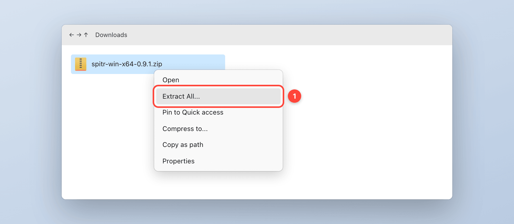

# Install spitr on Windows

Requires 64-bit Windows 10 (version 2004 or later) or Windows 11. spitr for Windows is a
**pre-release**: the core paths are tested on Windows 11, not every app and setup.

> The pictures below are illustrations of each step, not screenshots. The buttons and settings you
> click have the names Windows shows; the surrounding wording can differ slightly between versions.

## 1. Download and unpack

1. Open the [releases page](https://github.com/MotionComplex/spitr-releases/releases) and download
   `spitr-win-x64-<version>.zip` from the newest *spitr for Windows* release.
2. Right-click the zip → **Extract All...** → choose a folder you keep, for example
   `C:\Users\<you>\Apps\spitr`. spitr runs from that folder; there is no installer and no .NET to
   install.



## 2. Allow the first launch

The build is not code-signed, so Microsoft Defender SmartScreen stops the first launch.

1. Double-click `spitr.exe`. In *Windows protected your PC*, click **More info**.
2. Check that the app is `spitr.exe`, then click **Run anyway**.


Only do this for a zip you downloaded from
[github.com/MotionComplex/spitr-releases](https://github.com/MotionComplex/spitr-releases/releases).

## 3. Install the speech model

On Windows the speech model is not downloaded automatically yet. spitr expects NVIDIA Parakeet v3
(the sherpa-onnx export, about 465 MB) in `%APPDATA%\spitr\models`. Open **PowerShell** (Start →
type *PowerShell* → Enter) and paste:

```powershell
$dst = "$env:APPDATA\spitr\models"
$tmp = Join-Path $env:TEMP "spitr-model"
New-Item -ItemType Directory -Force $dst, $tmp | Out-Null
curl.exe -L -o "$tmp\parakeet.tar.bz2" "https://github.com/k2-fsa/sherpa-onnx/releases/download/asr-models/sherpa-onnx-nemo-parakeet-tdt-0.6b-v3-int8.tar.bz2"
tar -xf "$tmp\parakeet.tar.bz2" -C $tmp
Get-ChildItem $tmp -Recurse -Include *.onnx, tokens.txt | Move-Item -Destination $dst -Force
Remove-Item $tmp -Recurse -Force
```

Afterwards `%APPDATA%\spitr\models` contains three `.onnx` files (encoder, decoder, joiner) and
`tokens.txt`. The setup assistant (step 5) shows a green dot in row 01 once spitr finds them; if
one is missing, the row names it and opens the folder.

## 4. Allow the microphone

Windows does not ask desktop apps for the microphone; it is a setting. Open **Settings →
Privacy & security → Microphone** and turn on:

- **Microphone access**
- **Let desktop apps access your microphone**


Nothing else needs to be granted: the dictation key and typing into other apps work without a
permission on Windows.

## 5. Run the setup assistant

The first launch opens the setup assistant; reopen it any time from the tray icon →
**Setup Assistant…**. Rows 01 and 02 turn green when the model and the microphone are ready.
Row 03 is optional: paste the API key of your cleanup provider and click **SAVE**. The provider
(Anthropic, OpenAI, Groq, OpenRouter, Ollama or any OpenAI-compatible endpoint) is chosen under
tray icon → **Settings…**. Without a key spitr types the raw
on-device transcript. Your key and your provider's terms and prices are your own; see
[PRIVACY.md](../PRIVACY.md) for what is sent where.


## 6. Dictate

Click into any text field, **hold the right Ctrl key**, talk, and let go. The text appears at your
cursor. **Esc** while recording cancels. Select text and press **Ctrl+Alt+S** to hear it read aloud.


## Updates

spitr for Windows does not update itself yet. Download the new zip, quit spitr from the tray icon,
and replace the files in your spitr folder. Settings, keys and the model live in `%APPDATA%\spitr`
and stay.

## Troubleshooting

| Symptom | Fix |
| --- | --- |
| Tray shows *Model error* | The model files are not directly in `%APPDATA%\spitr\models`. Run step 3 again. |
| The recording island appears but no text arrives | Microphone settings from step 4, and the right input device in **Settings → System → Sound**. |
| Text does not appear in an admin window (e.g. an elevated terminal) | Windows blocks input from normal apps into elevated ones. Run spitr as administrator for that window, or use a normal window. |
| Text arrives unpolished | No cleanup key set, or the provider rejected it. Tray icon → **Check Permissions** shows the cleanup status. |

## Uninstall

Quit spitr from the tray icon, delete your spitr folder, and delete `%APPDATA%\spitr` (it holds
your settings, your API keys and the speech model).
