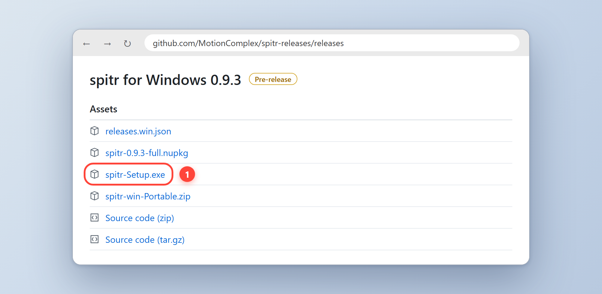
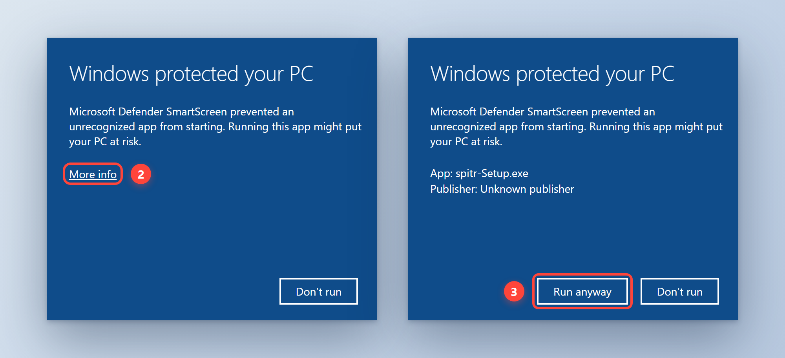
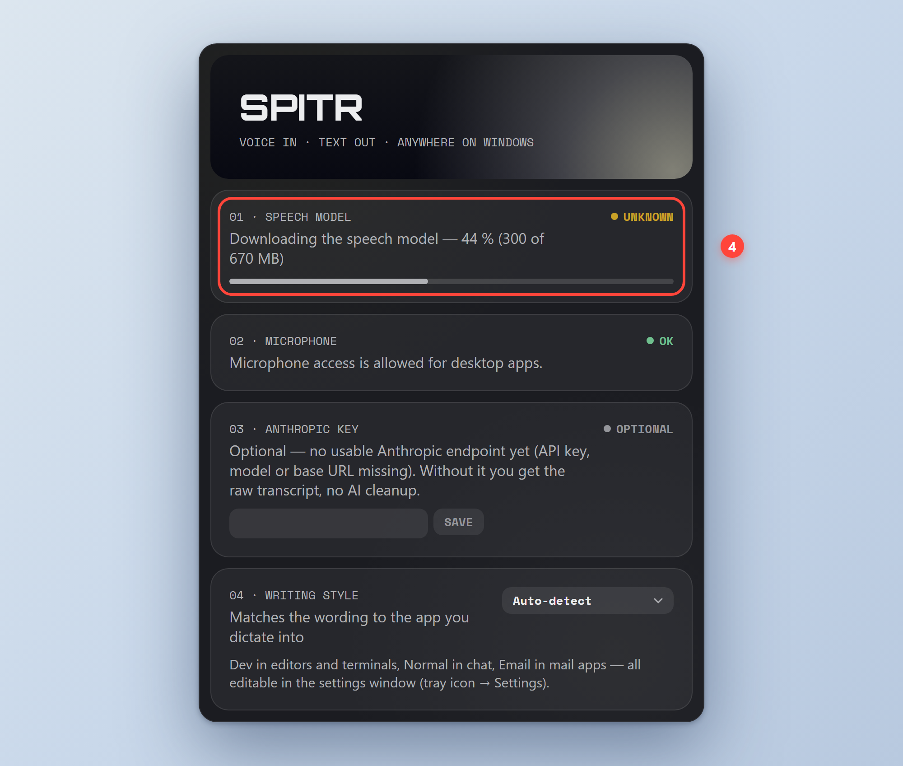
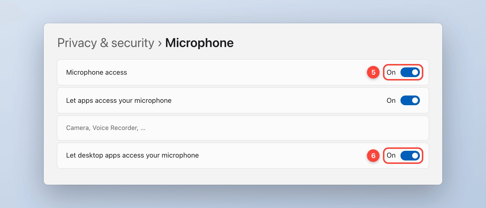
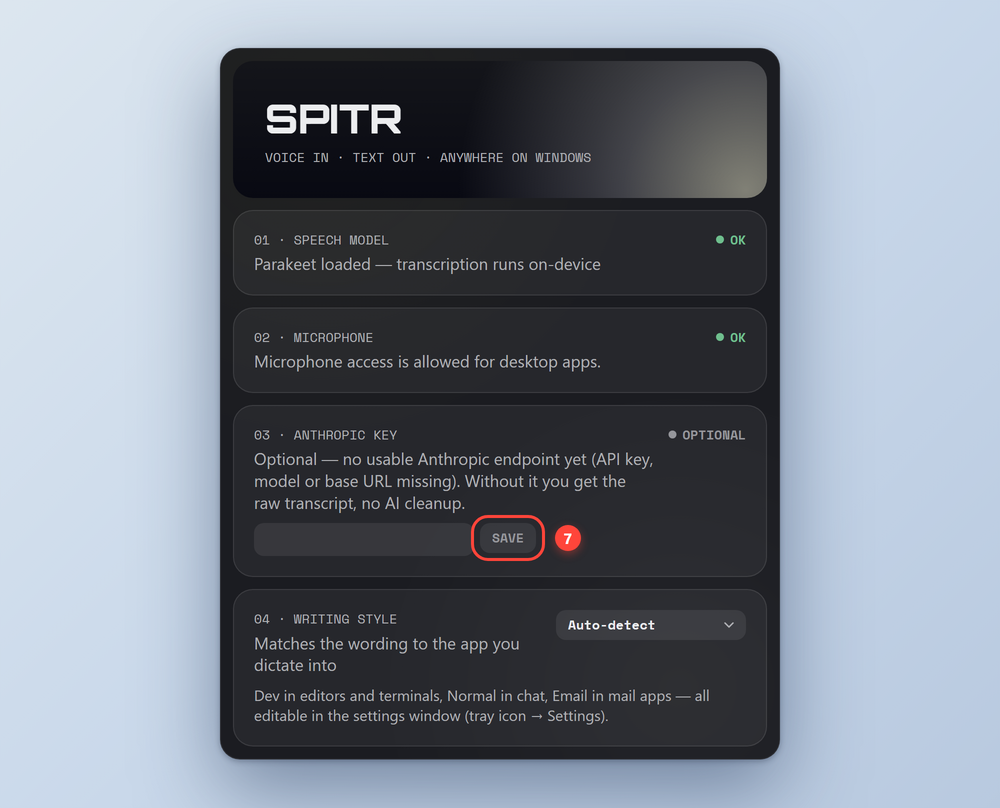

# Install spitr on Windows

Requires 64-bit Windows 10 (version 2004 or later) or Windows 11. spitr for Windows is a
**pre-release**: the core paths are tested on Windows 11, not every app and setup.

> The pictures below are illustrations of each step, not screenshots. The buttons and settings you
> click have the names Windows shows; the surrounding wording can differ slightly between versions.

## 1. Download and run Setup

1. Open the [releases page](https://github.com/MotionComplex/spitr-releases/releases) and, in the
   newest *spitr for Windows* release, download `spitr-Setup.exe` from the **Assets** list. The
   other files in that list are not needed for a normal install.
2. Double-click `spitr-Setup.exe` (your browser shows it in its downloads, or open your
   **Downloads** folder).

Your browser may warn that `spitr-Setup.exe` is not commonly downloaded. If you got it from the
releases page above, choose to keep it (in Edge: **…** → **Keep** → **Keep anyway**).

## 2. Allow the first launch

The build is not code-signed, so Microsoft Defender SmartScreen stops Setup the first time.

1. In *Windows protected your PC*, click **More info**.
2. Check that the app is `spitr-Setup.exe`, then click **Run anyway**.

Only do this for a file you downloaded from
[github.com/MotionComplex/spitr-releases](https://github.com/MotionComplex/spitr-releases/releases).

Setup installs spitr for your own Windows account only, so spitr itself does not need
administrator rights. It also installs Microsoft's Visual C++ runtime if your PC does not have it
yet (spitr's speech engine needs it); on such a PC Windows may ask for permission once for that
runtime. Setup puts spitr in your Start menu, adds a shortcut on your Desktop, lists it under
**Settings → Apps**, and starts it. spitr's icon appears in the tray next to the clock; if you do
not see it, click the **^** there. Updates later install without this prompt.

## 3. Wait for the speech model

The first launch opens the setup assistant. Row **01 · SPEECH MODEL** downloads NVIDIA Parakeet v3
for you (about 670 MB, from Hugging Face) and shows how far it has got. There is nothing to
click: keep spitr running and your computer online. If the download is interrupted (you quit
spitr, you go offline, the computer restarts), spitr continues from where it stopped the next time
it starts. Each file is checked against a checksum before it is used.

When it is done, the row shows a green **OK**, spitr says *Speech model ready*, and transcription
runs on your computer from then on. You can do step 4 while the download runs.

The model lives in `%APPDATA%\spitr\models`. If a complete Parakeet model is already there, spitr
uses it and does not download anything.

## 4. Allow the microphone

Windows does not ask desktop apps for the microphone; it is a setting. Open **Settings →
Privacy & security → Microphone** and turn on:

- **Microphone access**
- **Let desktop apps access your microphone**

Nothing else needs to be granted: the dictation key and typing into other apps work without a
permission on Windows.

## 5. Finish the setup assistant

Reopen it any time from the tray icon → **Setup Assistant…**. Rows 01 and 02 show a green **OK**
when the model and the microphone are ready; the **START DICTATING** button is available once they
are, and closes the window.
Row 03 is optional: paste the API key of your cleanup provider and click **SAVE**. The provider
(Anthropic, OpenAI, Groq, OpenRouter, Ollama or any OpenAI-compatible endpoint) is chosen under
tray icon → **Settings…**, and the row is named after it. Without a key spitr types the raw
on-device transcript. Your key and your provider's terms and prices are your own; see
[PRIVACY.md](../PRIVACY.md) for what is sent where.

## 6. Dictate

Click into any text field, **hold the right Ctrl key**, talk, and let go. The text appears at your
cursor. **Esc** while recording cancels. Select text and press **Ctrl+Alt+S** to hear it read aloud.

## Updates

spitr updates itself. Half a minute after it starts, and then once a day, it looks for a newer
*spitr for Windows* release and downloads it in the background. The update is installed the next
time spitr restarts or you quit it from the tray. A small notification tells you when an update is
ready; nothing else interrupts what you are doing.

- **Install it now:** once an update has been downloaded, the tray menu shows **Restart to
  Update (x.y.z)**. Click it and spitr restarts into the new version.
- **Look now:** tray icon → **Check for Updates…**.

Updates need no SmartScreen click. Your settings, keys and the speech model live in
`%APPDATA%\spitr` and stay.

## Moving from the zip version

Earlier Windows releases came as a zip you unpacked into a folder. To switch:

1. Quit the old spitr from its tray icon (**Quit spitr**).
2. Install with Setup, steps 1 and 2 above.
3. Delete the old folder. Your settings, API keys and speech model are in `%APPDATA%\spitr`, not in
   that folder, so the installed spitr picks them up as they were; the model is not downloaded
   again.
4. If **Launch at Login** was on, the installed spitr re-points it to itself the first time it
   runs, so it keeps working without any change from you.

## Troubleshooting

| Symptom | Fix |
| --- | --- |
| Row 01 reports that the download failed (the tray says *Speech model download failed*) | Tray icon → **Setup Assistant…** → **RETRY DOWNLOAD**. It carries on where it stopped and checks every file. The row names the cause; see the next two rows. |
| Row 01 says *Not enough free space* | Free up room on the drive it names, then click **RETRY DOWNLOAD**. The download needs just under 1 GB free (the 670 MB model plus a safety margin); the row gives the exact figure. |
| Row 01 reports a connection or checksum error | Check that your firewall, VPN or proxy lets spitr reach `huggingface.co` (it sends the download on to its own file servers), then click **RETRY DOWNLOAD**. |
| Row 01 says the speech model looks damaged | Click **RETRY DOWNLOAD** in the same row: it replaces any file that is wrong and keeps the rest. |
| The recording island appears but no text arrives | Microphone settings from step 4, and the right input device in **Settings → System → Sound**. |
| Text does not appear in an admin window (e.g. an elevated terminal) | Windows blocks input from normal apps into elevated ones. Run spitr as administrator for that window, or use a normal window. |
| Text arrives unpolished | No cleanup key set, or the provider rejected it. Tray icon → **Check Permissions** shows the cleanup status. |
| The tray menu has no **Check for Updates…** | Only a copy installed with Setup updates itself. Quit this copy, install with Setup (step 1) and delete the old folder. |

## Uninstall

Open **Settings → Apps** (*Installed apps* on Windows 11, *Apps & features* on Windows 10), find
**spitr** and choose **Uninstall**. That removes the program, its Start-menu and Desktop shortcuts,
its entry in the Apps list and the Launch at Login entry.

It keeps `%APPDATA%\spitr`, which holds your settings, your API keys and the speech model (about
670 MB), so a later install picks up where you left off. To remove everything, delete that folder
by hand afterwards: press **Win+R**, type `%APPDATA%`, press Enter, and delete the `spitr` folder.
